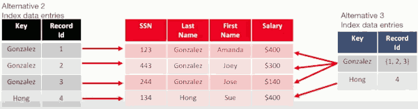

# 7 Refinements on Indexes and B+ Trees

## Search Key and Ordering

- Defn: A **composite search key** on columns ( k₁,k₂,..., kn ) "matches" a query if:
    - The query is a conjunction of m≥0 equality clauses of the form
        - k₁=<val₁> AND k₂=<val₂> AND ... AND km=<valm>
    - and at most 1 additional range clause of the form:
        - AND km+1 op <val>  (where op is one of { \<,\> })

- Why does this "match"? Lookup and scan in lexicographic order
    - Can do a lookup on equality conjuncts to find start-of-range
    - Can do a scan of contiguous data entries at leaves
        - satisfy the m+1st conjunct
        - of if there is no m+1st conjunct
            - scan the entire set of matches to the first m conjuncts

- **Composite Keys**:  more than one column
    - **Lexicographics order**
    - Search a range?
    - ( Age, Salary ):
        - Age==31 & Salary=400  (matched)
            - when scan a row with Age>31, we can end this query.
        - Age==55 & Salary>200  (matched)
        - Age>31 & Salary=400 (**not** matched)
        - Age=31  (matched)
        - Age>31  (matched)
        - Salary=300  (**not** matched)

---

[tree-index-extensions](slides/6a-tree-index-extensions.pdf)

## Alternative 2 vs Alternative 3  Table Illustration

