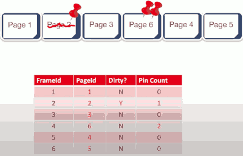

# Buffer Management

## Dirty Pages

- Questions We Need to Answer
    1. Handling dirty pages
        - the pages where updates have occurred in RAM
    2. Page Replacement
        - when the buffer pool is full of pages and you'd like to access another page on the disk

- Handling dirty pages
    - How will the buffer manager find out which page is dirty ?
        - Dirty bit on page ( a bit associated with each frame says that the page in that fram is dirty )
    - What to do with a dirty page ?
        - Write back via disk manager

- Advanced Questions
    - Concurrent operations on a page
        - imagine you have many writers and readers on same page.
        - Solved by Concurrency Control module
    - System Crash before write-back
        - when pages are dirty in the buffer pool, if the system crashes, changes hasn't been reflected to the disk.
        - Solved by Recovery module

## Buffer Manager State

- Buffer pool: Large range of memory, malloc'ed at DBMS server boot time
    - memory in page size units,  called frames.
- Buffer Manager metadata: Smallish array in memory
    - that describes what's in the buffer pool right now.
    - FrameID / PageID / Dirty ? / Pin Count
    - we're gonna keep this data structure indexed by the pageID, so that you can do quick lookups in here and say where is page 6 ? It's in frame 4.

- 

## Page Replacement

- Page Replacement Terminology Review
    - How will the buffer mgr know if a page is "in use"?
        - **page pin count**
    - If buffer manager is full, what page should be replaced?
        - **page replacement policy**
- When a page is requested ...
    1. If a requested page is not in pool:
        - Choose an **un-pinned** (pin_count = 0) frame for replacement
        - if frame "dirty", write current page to disk, mark "clean"
        - read requested page into frame
    2. Pin the page and return its address
- If requests can be predicted(e.g. sequential scans) pages can be pre-fetched
    - serveral pages at a time, and each of them is gonna replace a previous page following the rules.

## After Requestor Finishes

1. Requestor of page must:
    - set dirty bit if page was modified
    - unpin the page( preferably soon!)
        - Note: it is requestor's duty to unpin it, not buffer manager
2. Page in pool may be requested many times
    - a pin count is used
    - to pin a page: pin_count++
    - A page is a candidate for replacement iff
        - pin_count == 0 ("unpinned")

3. CC & recovery may do additional I/Os upon replacement
    - Write Ahead Log protocol; more later!

## Page Replacement Policies

- Twopolicieswewilldiscuss:
    - Least-recently-used (LRU), Clock
        - page 18
    - Most-recently-used (MRU)
- Policycanhavebigimpacton#I/Os
    - Depends on the access pattern.
