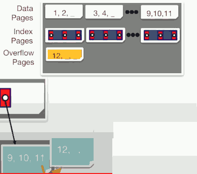

# ISAM

## Build a high fan-out search tree

- Disk Layout ?
- All in a single file,  the leaf level, Data pages, first. 
    - followed by the index pages with the root first and then the reset of the tree in some orders, say in BFS.
- 

- Some design goals:
    - Fast sequential scan ?  Yes. No random I/O.
    - High Fan-out ? Yes.
    - Support Insertion ?  Maybe not so much, it is one of the weaknesses of our design so far.

- This datastructure has a name:
    - ISAM, Indexed Sequential Access Method,  Eearly IBM Indexing Technology.

## ISAM

- Data entries in sorted heap file
- High fan-out static tree index
- Fast search + good locality
    - Assuming nothing changes
- Insert into overflow pages.
    - A linked list is appended to the appropriate leaf page and becomes a store for overflow pages
    - 

## A Note a Caution

- ISAM is an old-fashioned idea
    - Introduced by IBM in 1960s
    - B+ trees are usually better (though not always)
- But, it's a good place to start
    - Simpler than B+ tree, many of the same ideas
- Upshot
    - Don't brag about ISAM on you resume
    - Do understand ISAM, and tradeoffs with B+ trees.

# B+ Tree

## Enter the B+ Tree

- Similar to ISAM
    - Same interior node structure
        - (key, page ptr) pairs with same key invariant (key order)
    - Same search routine as before
- Distinguish: **Dynamic Tree Index**
    - Always Balanced
    - Support efficient insertion & deletion
        - Grows at root not leaves! ( so as to guarantee tree is balanced )
- "B+", where is the `+` from ? 
    - The original B tree has data stored at interior nodes,  B+ tree stores all data at the leaves, this is useful for range search.

- One of the interesting facts about a B+ tree is that it has an occupancy invariant. We didn't have this with the ISAM.
    - It's an invariance a rule that says the occupancy or the fill factor of each node must be at least 1/2 the capacity.
    - more details in PDF [Example of a B+ Tree].

## B+ Trees in Practice

- Typical order: 1600. Typical fill-factor: 67%
    - average fan-out=2144
- At typical capacities
    - Height 1: 2144² = 4,596,735 
    - Height 2: 2144³ = 9,855,401,984

## Searching 

- B+ tree is good at 1-record lookup,  not so good at scaning a range of records.

