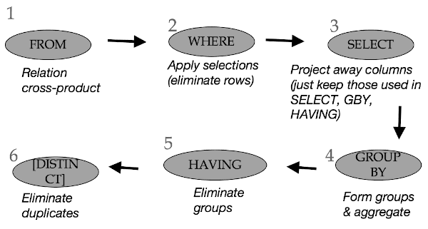

# Sql 2

## Conceptual SQL Evaluation



Optional ORDER BY and LIMIT applied at end, for "format" output.


## Cross Product: Join Query

Queries on multiple tables, these are queries that perform joins.

```sql
SELECT [DISTINCT] <column expression list>
FROM <table1 [AS t1], ... , tableN [AS tn]>
[WHERE <predicate>]
[GROUP BY <column list>[HAVING <predicate>] ]
[ORDER BY <column list>];
```

- The main distinction here is that the **FROM** clause, now has a list of tables. 
    - At the first step of our pipeline we have a cross-product of the relations. 
    Basically you're gonna take the tables in the FROM clause and form all combinations of their tuples. This is gonna to create a big relation conceptually.


## Column Names and Table Aliases

```sql
SELECT Sailors.sid, sname, bid
FROM Sailors, Reserves
WHERE Sailors.sid = Reserves.sid

SELECT S.sid, sname, bid
FROM Sailors AS S, Reserves AS R
WHERE S.sid = R.sid
```

We can also use aliases in the output.

```sql
SELECT x.sname, x.age,
    y.sname AS sname2,
    y.age AS age2
FROM Sailors AS x, Sailors AS y
WHERE x.age > y.age
```

- Table aliases in the FROM clause
    - Needed when the same table used multiple times (**self-join**)
- Column aliases in the SELECT clause
- You can NOT use origin table name after creating an alias ?


## Arithmetic and String Comparison

- You can do arithmetic calculation in `select` and `WHERE` clause

```sql
SELECT S.age, S.age-5 AS age1, 2*S.age AS age2
FROM Sailors AS S
WHERE S.sname = 'Popeye’
```

```sql
SELECT S1.sname AS name1, S2.sname AS name2
FROM Sailors AS S1, Sailors AS S2
WHERE 2*S1.rating = S2.rating - 1
```

- String Comparison

```sql
// Old-school SQL
SELECT S.sname
FROM Sailors S
WHERE S.sname LIKE 'B_%’
```

- here, `_` is a single character wildcard, `%` is the repeat pattern, something like `*` in re.
    - so it said I want the student name which start with B followd at least 1 more character.


```sql
// Standard Regular Expressions
SELECT S.sname
FROM Sailors S
WHERE S.sname ~ 'B.*’
```

## Combining Predicates

- Subtle connections between:
    - Boolean logic in WHERE (i.e., AND, OR)
    - Traditional Set operations (i.e. INTERSECT, UNION)

```sql
SELECT R.sid
FROM Boats B, Reserves R
WHERE R.bid=B.bid AND
    (B.color='red' OR B.color='green')
```

**VS**

```sql
SELECT R.sid
FROM Boats B, Reserves R
WHERE R.bid=B.bid AND B.color='red'

UNION ALL

SELECT R.sid
FROM Boats B, Reserves R
WHERE R.bid=B.bid AND B.color='green'
```

- similarly, AND **VS** INTERSECT

- Find sailors who have **NOT** reserved a boat

```sql
SELECT S.sid
FROM Sailors S

EXCEPT

SELECT S.sid
FROM Sailors S, Reserves R
WHERE S.sid=R.sid
```

## Set and Multiset Semantics

- Set: a collection of **distinct** elements
- Standard ways of manipulating/combining sets
    - Union
    - Intersect
    - Except
- Treat tuples within a relation as elements of a set

```sql
R = {A, A, A, A, B, B, C, D}
S = {A, A, B, B, B, C, E}

UNION
{A, B, C, D, E}

INTERSECT
{A, B, C}

EXCEPT  // in R but not in S
{D}
```

### “ALL”: Multiset Semantics

- In multiset sementics we're going to keep track of the number of copies or the cardinality.

```sql
R = {A, A, A, A, B, B, C, D} = {A(4), B(2), C(1), D(1)}
S = {A, A, B, B, B, C, E} = {A(2), B(3), C(1), E(1)}
```

- These notation is going to hardy for explaining things here you don't actually use this notation in practice.


### “UNION ALL”: Multiset Semantics

- SQL has these **ALL** variants of the set operators.

```sql
R = {A, A, A, A, B, B, C, D} = {A(4), B(2), C(1), D(1)}
S = {A, A, B, B, B, C, E} = {A(2), B(3), C(1), E(1)}

UNION ALL: sum of cardinalities

{A(4+2), B(2+3), C(1+1), D(1+0), E(0+1)}
= {A, A, A, A, A, A, B, B, B, B, B, C, C, D, E}
```

### “INTERSECT ALL”: Multiset Semantics

```sql
R = {A, A, A, A, B, B, C, D} = {A(4), B(2), C(1), D(1)}
S = {A, A, B, B, B, C, E} = {A(2), B(3), C(1), E(1)}

INTERSECT ALL: min of cardinalities

{A(min(4,2)), B(min(2,3)), C(min(1,1)),
D(min(1,0)), E(min(0,1))}
= {A, A, B, B, C}
```

### “EXCEPT ALL”: Multiset Semantics

```sql

```
R = {A, A, A, A, B, B, C, D} = {A(4), B(2), C(1), D(1)}
S = {A, A, B, B, B, C, E} = {A(2), B(3), C(1), E(1)}

EXCEPT ALL: difference of cardinalities

{A(4-2), B(2-3), C(1-1), D(1-0), E(0-1)}
= {A, A, D }
