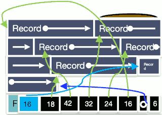

# Disks, Buffers and Files

## Records

- Tables stored as logical files
    - Consist of pages
        - Pages contain a collection of records
- Pages are managed
    - On disk
        - by the disk space manger: pages read/written to physical disk/files
    - In memory
        - by the buffer manager: higher levels of DBMS only operate in memory

- 

### Files of Pages of Records

- **DB FILE**: A collection of pages, each containing a collection of records.
- API for higher layers of the DBMS:
    - insert/delete/modify record
    - Fetch a particular record by **record id**...
        - Record id is a pointer encoding pair of (**pageID, location** on page)
    - Scan all records
        - Possibly with some conditions on the records to be retrieved

### Many DB File Structures

- Unordered Heap Files
    - Records placed arbitrarily across pages
- Clustered Heap Files
    - Records and pages are grouped into records with similar values
- Sorted Files
    - Pages and records are in sorted order
- Index Files
    - B+ Tres, Linear Hashing, ...
    - May contain records or point to records in other files

### Heap File Naive Implemented as List

- Heap file has one special “Header page”
    - and a name associated with the heap file as well.
    - Header page ID( id also tells its location ) and Heap file name are stored at some particular location on the disk, called database catalog
- Every page in heap file contains 2 “pointers” 
    - **free space** and **data** pointer
    - all the data pages will have some free space potentially and some data.
        - is divided into 2 dould linked list, one is full pages list in which are all pages without free space,  the other is the list of pages with free space.
        - Header file is the header of those 2 linked list.

- 

- What is wrong with this?
    - How do I find a page with enough space for a 20 byte record
    - A: Need to access many pages (w/ free space) to check

### Use a Page Directory

- Directory, is a **linked list**, with multiple **Header Pages**
    - each header page encoding:
        - A pointer to data page
        - #free bytes on the page
    - the first header page ( header of the linked list ) is stored in the catalog.
- So for every data page, we'll have one pointer to it from the header page, and the header pages will keep the number of free bytes associated with each page.

- 

- Header pages accessed often -> likely in cache
- Finding a page to fit a record required far fewer page loads than linked list. Why?
    - One header page load reveals free space of many pages
- You can imagine optimizing the page directory further
    - E.g., compressing header page, keeping header page in sorted order based on free space, etc.
    - but it's unclear that it's necessary. Because with a small number of header pages, you've already covered a pretty large data file.

## PAGE LAYOUT

### Page Basics: The Header

- Header may contain “metadata” about the page, e.g.
    - Number of records
    - Free space
    - Maybe a next/last pointer
    - Bitmaps, Slot Table

### Things to Address

- Some options:
    - Record length? Fixed or Variable
    - Page layout? Packed or Unpacked
        - in terms of its free space
- Some questions:
    - Find records by record id?
        - Record id = (Page, Location in Page) 
    - How do we add and delete records?

### Fixed Length Records, Packed

- Pack records densely
- Record id = (pageId, “location in page”)?
    - (pageId, record number in page)!
    - We know the offset from start of page!
        - Offset = header + (record size) x (n-1) 

- 

- Easy to add: just append
- Delete? ( delete page 2, record 3 )
    - Packed implies re-arrange!
    - “record id” - (Page 2, Record 4) now need to be updated to (Page 2, Record 3)
    - Record Ids need to be updated!
    - Could be expensive if they’re in other files.

### Fixed Length Records: Unpacked

- Keep a bitmap in the page header, that's gonna have a bit for each sort of slot on the page.
- Bitmap denotes “slots” with records
- Record id now is gonna be the page ID, and then the slot number in page.
    - (pageId, slotId)

- Insert: find first empty slot in bitmap
- Delete: Clear bit
    - No reorganization needed!
    - Small cost of a bitmap, which can be very compact

- 

### Variable Length Records

- We’ve already seen that packed isn’t the best idea, so let’s consider the unpacked case

- How do we know where each record begins (mapping recordid to location)?
- What happens when we add and delete records?

### First: Relocate metadata to footer

- We’ll see why this is handy shortly...

### Slotted Page

We're going to fill up that footer with a somewhat different kind of metadata. We're gonna have what's called **slot directory**.

- 

- Introduce slot directory in footer
    - Pointer to free space
    - Length + Pointer to beginning of record
        - reverse order

The very first entry in the slot directory all the way at the end of the page to the right(see 'o' in footer).

so this is the first entry from the end in words, a pointer to free space, and this is the place where new records are going to get inserted.

And then for each other entry in the slot directory, we're going to have a pair which is a length of a record , and a pointer (or if you like an offset) on the page to the beginning of the records.  For example the **first** slot on this page is ( length:16, offset:0 ). The **2nd** records is of length 24, and it's at some other offset on the page.

- Record ID = location in slot table
    - from right
- Delete?
    - e.g., 4th record on the page

### Slotted Page: Delete Record

- Delete record (Page 2, Record 4):
    - Set 4th slot directory pointer to null
        - no length, no pointer
    - Doesn’t affect pointers to other records (no internal reorg, and no updating of external pointers)

- 

### Slotted Page: Insert Record

- Insert:
    1. Place record in free space on page
    2. Create pointer/length pair in next open slot in slot directory
        - here we reuse slot #4.
        - so this is gonna be the new record 4, with different length: 42.
    3. Update the free space pointer
- Fragmentation?
    - Reorganize data on page!
    - basically pack all the records back together and then change the pointers.
 
### Slotted Page: Leading Questions

- Reorganize data on page
    - Is this safe?
        - Yes this is safe because records ids don’t change. Record ids refer to slots.
- When should I reorganize?
    - We could re-organize on delete
    - Or wait until fragmentation blocks record addition and then reorganize.
    - Often pays to be a little sloppy if page never gets more records.
- What if we run out of slots in the footer but there's plenty of space for new tuples(rows) ?

### Slotted Page: Growing Slots

- Tracking number of slots in slot directory
    - Empty or full

Well here's why having the footer at the end is good thing.

So we'll track the number of slots in the slot directory we actually didn't record this before. 

So we modify our design now to have a number of slots as the first entry on the far right. And we move the pointer to free space to the 2nd entry.

- 

If we want to extend the slot directory, it turns out we have more tuples that we want to put on this page and there's still free space. 

We can add another slot to the slot directory going right to left. Basically the slot directory goes from the end inwards to the middle,  and the record storage grows from the beginning of the page inwards to the middle, like heap and stack... When the slot directory of the records kind of meet each other , that's when the page is full.

- If full slots = number of slots, then extend slot directory
- To extend slot directory
    - Slots grow from end of page inward
    - Records grow from beginning of page inward 
    - Easy
- And update count

- 

### Slotted Page: Summary

- Typically use Slotted Page
    - Good for variable and fixed length records
    - a little bit waste for fixed lenght record because we don't need length
- But it is still not bad for fixed length records
    - Why?
    - Fixed length records also have NULL fields
    - NULL values can be “squashed” and indicated using a flag, avoiding full
attribute length storage
    - But, if we have only non-NULL fields, can be worth the optimization of fixed-length format

## RECORD LAYOUT

Now we've talked about how to pack records on a page, the next question is how to pack fields in a record.

### Record Formats

- Each record in a table/relation has a fixed combo of types
- Relational databases also use same page format for data on disk or in memory
    - Save cost of conversion (known as serialization/deserialization)
- Assume System Catalog stores the Schema
    - No need to store type information with records (save space!)
    - Catalog is just another table
- Goals:
    - Fast access to fields (why?)
        - wo want to look up individual fields quickly because we often select some specific column.
    - Records should be compact
        - so that we have efficient I/O so we don't do more I/O than we need to do because we keep the data small
- Easy Case: Fixed Length Fields
- Interesting Case: Variable Length Fields
    - we also have same problem on the record level, but now we are doing it on the field level.

### Record Formats: Fixed Length

- Field types same for all records in a file
    - Type info stored separately in system catalog
- On disk byte representation same as in memory
- Finding i'th field ?
    - done via arithmetic (fast)
- Compact ?  (Nulls?)
    - If all fields are not-null, no good way of compacting
    - Else apply variable length techniques

### Record Formats: Variable Length

There's a bunch of problems when things get to be variable.

- What happens if fields are variable length?
    - e.g  the first 2 columns are `vchar`
    - `BOB|Big,St.|M|32|94703`
- Could store with padding? (Essentially fixed length)
    - char(20) ?
    - But have to account for largest possible string (wasteful) or rearrange as soon as a larger string comes (inefficient).
- Could store with delimiters (e.g., commas)?
    - `BOB，Big,St.，M，32，94703`
    - But makes it hard to find fields (scanning cost in memory) and also ensure that commas are not part of the string.
- Idea: Move all variable length fields to end to make the access more quick

- Introduce a record header
    - 
    - we're gonna put the vairable length fields toward the end, 
    - and the record header has pointers that point to the **end** of variable length fields.
    - and the fixed length fields are all going to be at the beginning.
    - what's the starting position of "Bob"? 
        - we already know,  it is a constant, we know in advance.
- No "escaping", Easy access to fields, and almost as compact as can be (modulo header)
- Other advantages?
    - Same approach can be used to squash fixed length null fields with many nulls
    - useful for fixed length records too!

